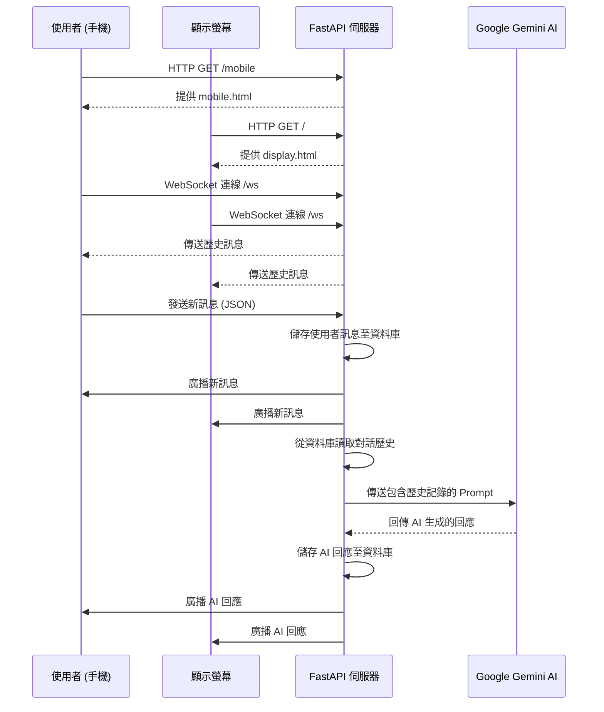
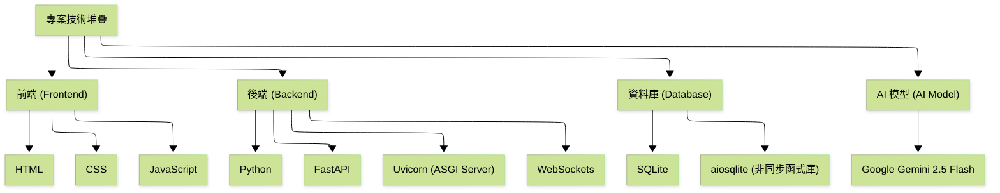
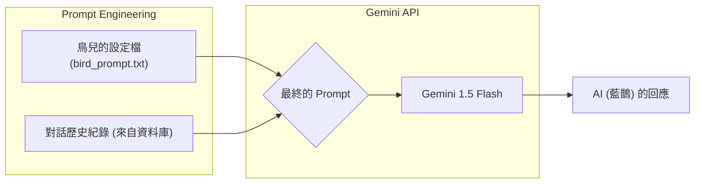
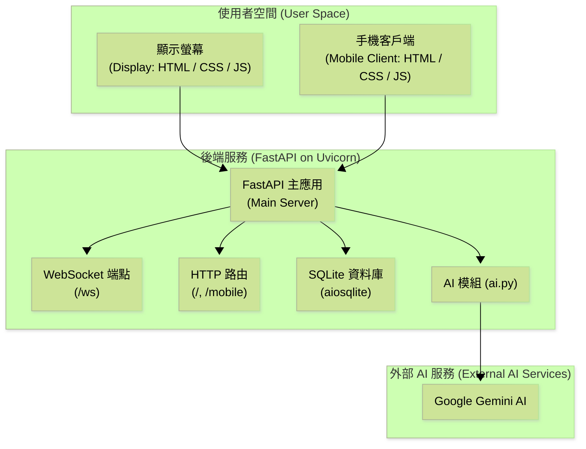

# ABMI Bird Chat Room

## Project Description

This project is a real-time, interactive web application that displays a chat room. Messages sent from a mobile client are displayed on a main screen as speech bubbles next to an animated bird. The application uses WebSockets for instant communication and stores chat history in a local SQLite database.

## Features

- **Real-time Chat**: A global chat room where messages are broadcast to all connected clients instantly.
- **Persistent History**: Chat history is saved in an SQLite database and loaded for every new client.
- **Animated Display**: The main display screen features a flying bird animation.
- **Comic-Style UI**: Chat messages are rendered as speech bubbles for a fun, visual experience.
- **Simple Mobile Client**: A straightforward mobile web page allows users to join the chat and send messages.

## Technology Stack & Key Functions

This project uses a modern, lightweight technology stack. Below is an overview of the key components and the functions they provide.

### Backend

- **Python**: The core programming language for the server-side logic.
- **FastAPI**: A high-performance Python web framework used for building the API and WebSocket endpoint.
  - `uvicorn`: The ASGI server that runs the FastAPI application.
  - **Key Function**: `@app.websocket("/ws")` is the decorator that establishes the main WebSocket endpoint. This single endpoint manages all real-time communication for the global chat room.
- **aiosqlite**: An asynchronous library for interacting with the SQLite database, which integrates perfectly with FastAPI's async nature.
  - **Key Functions**:
    - `init_db()`: Creates the `chat_history.db` file and the `messages` table on application startup.
    - `add_message()`: Inserts a new message into the database.
    - `get_all_messages()`: Retrieves the entire chat history to send to new clients.
- **WebSockets**: The protocol enabling two-way, real-time communication between the server and all connected clients.

### Frontend

- **Vanilla HTML/CSS/JavaScript**: The frontend is built without any heavy frameworks to keep it simple and fast.
- **Key JavaScript Functions**:
  - `new WebSocket()`: The standard browser API used by clients to connect to the server's `/ws` endpoint.
  - `socket.onmessage`: The event handler that processes messages received from the server. It listens for `history` messages to render the past chat, and `new_message` events to display live messages.
  - `socket.send()`: The function used to send a user's message (as a JSON string) to the server.
  - `setInterval()`: A simple but effective function used on the display page to create the bird's flapping animation by toggling the image source every 500ms.

## Project Structure

```
/
├── pyproject.toml       # Defines dependencies and scripts for the uv workflow
├── main.py              # Main FastAPI application, handles WebSockets
├── database.py          # Manages all SQLite database operations
├── ai.py                # Handles AI response generation
├── bird_prompt.txt      # Contains the prompt for the bird's persona
├── templates/
│   ├── display.html     # The main screen with the bird and chat bubbles
│   └── mobile.html      # The mobile client for sending messages
└── static/
    ├── css/style.css    # Styles for both display and mobile pages
    ├── js/
    │   ├── display.js   # Logic for the display page (animation, receiving messages)
    │   └── mobile.js    # Logic for the mobile client (username prompt, sending messages)
    └── assets/
        ├── Background.JPG # The background image
        ├── Bird1.PNG      # Bird animation frame 1
        └── Bird2.PNG      # Bird animation frame 2
```

## 專案架構與說明 (Project Architecture and Explanation)

本節將透過圖表說明專案的架構、訊息流程與關鍵技術。

### 1. API、使用者互動與訊息流程 (API, User Interaction, and Message Flow)

此圖表展示了從使用者連線到 AI 回應的完整流程。



**流程說明：**
1.  **頁面載入**：使用者分別透過手機和顯示螢幕的瀏覽器請求網頁，後端 FastAPI 伺服器回傳對應的 HTML 檔案。
2.  **WebSocket 連線**：兩個客戶端（手機和顯示螢幕）都會與後端的 `/ws` 端點建立 WebSocket 長連線。連線成功後，伺服器會立即將資料庫中的歷史訊息傳送給新連線的客戶端。
3.  **使用者傳送訊息**：使用者在手機端輸入訊息並傳送。
4.  **後端處理**：
    - 伺服器接收到訊息後，先將其儲存至 SQLite 資料庫。
    - 接著，將此新訊息廣播給所有連線的客戶端（包括手機和顯示螢幕）。
5.  **AI 回應生成**：
    - 伺服器從資料庫讀取包含新訊息的完整對話歷史。
    - 將對話歷史與預設的 Prompt 結合，向 Google Gemini AI 發送請求。
    - AI 模型根據上下文生成回應。
6.  **廣播 AI 回應**：伺服器收到 AI 的回應後，將其儲存至資料庫，並廣播給所有客戶端，完成一次完整的互動。

### 2. 技術堆疊 (Technical Stack)

此圖表概括了本專案所使用的主要技術。



**技術說明：**
- **前端 (Frontend)**：使用原生的 HTML、CSS 和 JavaScript，沒有引入任何框架，以保持輕量化和高效率。
- **後端 (Backend)**：以 Python 為核心，使用 FastAPI 框架處理 HTTP 請求和 WebSocket 通訊。Uvicorn 作為 ASGI 伺服器運行 FastAPI 應用。
- **資料庫 (Database)**：選用輕量的 SQLite 儲存聊天記錄，並透過 `aiosqlite` 函式庫進行非同步操作，以配合 FastAPI 的非同步特性。
- **AI 模型 (AI Model)**：整合 Google 的 Gemini 1.5 Flash 模型，用於生成藍鵲角色的回應。

### 3. 大型語言模型使用方式 (LLM Usage)

此圖表解釋了如何建構 Prompt 以便讓大型語言模型（LLM）能夠生成符合情境的回應。



**Prompt 結構說明：**
為了讓 AI 能夠扮演「藍鵲」這個角色並理解對話的上下文，我們將以下兩部分組合成一個完整的 Prompt：
1.  **系統提示 (System Prompt)**：存放在 `bird_prompt.txt` 檔案中，定義了藍鵲的背景故事、性格（智慧、神秘、詩意）以及回應的語氣和語言（繁體中文）。這為 AI 的人格設定了基礎。
2.  **對話歷史 (Conversation History)**：從資料庫中讀取完整的聊天記錄，並將其格式化後附加到系統提示之後。這為 AI 提供了對話的上下文，使其能夠針對使用者的最新訊息做出有意義的回應。

最終，這個結合了「角色扮演指令」和「對話上下文」的完整 Prompt 會被送到 Gemini 模型，模型會根據這些資訊生成下一句藍鵲的回應。

### 4. 總體架構圖 (Overall Architecture Diagram)

此圖表使用 `architecture-beta` 類型，總結了整個專案的組件、技術和它們之間的互動關係。



**架構說明：**
- **使用者空間 (User Space)**：包含使用者直接互動的前端應用，由純 HTML/CSS/JS 構成。
- **後端服務 (Backend Service)**：基於 Python 的 FastAPI 應用，運行在 Uvicorn ASGI 伺服器上。
  - **FastAPI 主應用**：作為核心，內部包含處理 HTTP 請求和 WebSocket 通訊的邏輯。
  - **SQLite 資料庫**：透過 `aiosqlite` 進行非同步存取，儲存所有對話。
  - **AI 模組**：`ai.py` 檔案，負責與外部 Gemini API 溝通。
- **外部 AI 服務 (External AI Service)**：我們使用 Google Gemini AI 來生成藍鵲的回應。

這個架構圖清晰地展示了從使用者到後端服務，再到外部 AI 的完整流程，並標示了各個環節使用的關鍵技術。

## Setup and Running the Application

Follow these steps to get the project running locally.

### 1. Prerequisites

- **uv** (Python package installer, can be installed via `pip install uv`)

### 2. Install Dependencies

With the environment activated, `uv` will use the `pyproject.toml` file to install all necessary packages. The `-e .` flag installs the project in "editable" mode.

```bash
uv sync
```

### 3. Run the Application

This command executes the `start` script defined in `pyproject.toml`, which runs the Uvicorn server.

```bash
uv run uvicorn main:app --host <host_name> --port <port>
```

### 4. Access the Application (Demo)

Once the server is running, you can access the two parts of the application:

- **Display View**: Open your web browser on computer (laptop or PC) and navigate to **[main display page](https://43-213-46-114.sslip.io/)**
- **Mobile Client**: Open another browser tab or use a mobile device and scan the QR code on the previous display page


Enter a username on the mobile client and start sending messages to see them appear on the display screen!
