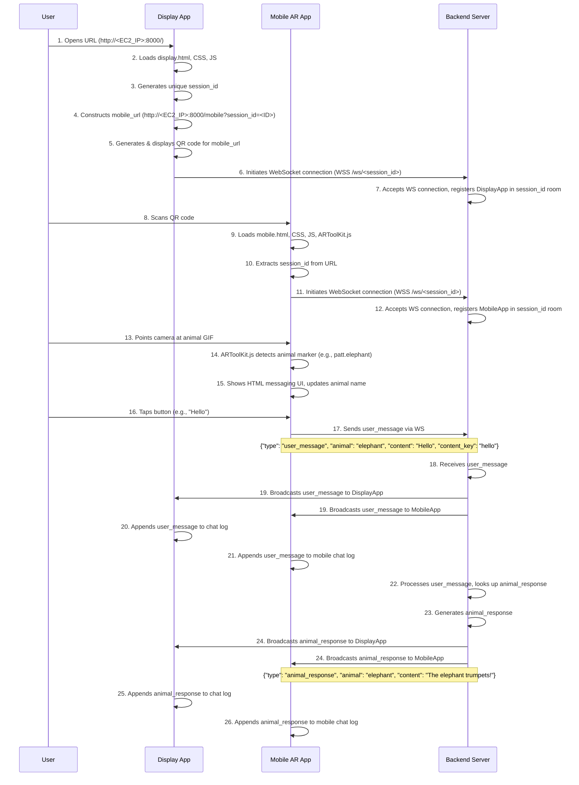

# Animal Messaging Interactive Demo (AMID)

This project is an interactive messaging experience designed for a public demo setting. It allows users to "talk" to virtual animals displayed on a large screen by using an AR-enabled web application on their smartphones.

The experience consists of two primary frontends and one backend:

1.  **Display App:** A website intended for a large screen (like a TV or projector). It displays animated animal pictures and a QR code. When a user starts a conversation, this screen shows the dialogue in real-time.
2.  **Mobile AR App:** A mobile-first website that users access by scanning the QR code. It uses the phone's camera to provide an Augmented Reality experience. When the user points their phone at an animal on the large screen, messaging options appear, allowing them to initiate and continue a conversation.
3.  **Backend Server:** The central hub that connects the Display and Mobile apps. It manages the real-time chat connection and serves all the web content.

## Architecture and Technical Design

The entire system is designed to run on a single server (e.g., an Amazon EC2 instance) and uses a modern, lightweight technology stack.

### Technology Stack

*   **Backend:** **Python 3** with the **FastAPI** framework.
    *   **Server:** `uvicorn`
    *   **Real-time Communication:** `websockets`
*   **Display Frontend:** Plain **HTML5**, **CSS3**, and **JavaScript**.
    *   **QR Code Generation:** A client-side JavaScript library.
*   **Mobile AR Frontend:** **ARToolKit.js** for marker detection, with standard **HTML5**, **CSS3**, and **JavaScript** for the messaging UI.
*   **Deployment:** A single server instance where the FastAPI application runs and serves all content.

### API and Communication Flow

Communication between the server, the display, and the mobile client is handled in real-time via **WebSockets**.

**1. Session Initiation:**

*   The Display App loads and generates a unique `session_id`.
*   It creates a URL for the mobile app containing this ID: `https://<your-domain>/mobile?session_id=<unique_id>`.
*   This URL is rendered as a QR code on the display.
*   The Display App connects to the backend WebSocket endpoint: `wss://<your-domain>/ws/<unique_id>`.

**2. Mobile Client Connection:**

*   A user scans the QR code, opening the Mobile AR App.
*   The mobile app reads the `session_id` from the URL.
*   It connects to the same WebSocket endpoint: `wss://<your-domain>/ws/<unique_id>`.
*   The server now has both the display and the mobile client linked in the same session.

**3. WebSocket API Endpoint:**

*   **Endpoint:** `/ws/{session_id}`
*   **Protocol:** WebSocket (WSS)
*   **Function:** Manages all real-time communication for a given session. The server maintains a "room" for each `session_id`, broadcasting incoming messages to all participants in that room.

**4. WebSocket Message Format:**

All messages sent over the WebSocket connection use a simple JSON structure:

```json
{
  "type": "user_message" | "animal_response" | "system_notification",
  "animal": "elephant" | "lizard" | "none",
  "content": "The message text."
}
```

*   `type`: Defines the nature of the message.
    *   `user_message`: A message sent from the mobile client.
    *   `animal_response`: A reply generated by the server on behalf of the animal.
    *   `system_notification`: A status message (e.g., "User has connected.").
*   `animal`: The animal being interacted with.
*   `content`: The text of the message.

### Detailed Interaction Sequence

This section outlines the step-by-step flow of interactions between the User, the Display App, the Mobile AR App, and the Backend Server.

1.  **User** opens **Display App** URL (`http://<EC2_IP>:8000/`) in a large screen browser.
2.  **Display App** loads `display.html` and associated static assets (CSS, JS).
3.  **Display App** (JavaScript) generates a unique `session_id`.
4.  **Display App** (JavaScript) constructs the `mobile_url` (e.g., `http://<EC2_IP>:8000/mobile?session_id=<ID>`).
5.  **Display App** (JavaScript) generates and displays a QR code containing the `mobile_url`.
6.  **Display App** (JavaScript) initiates a WebSocket connection to the **Backend Server**: `WSS <EC2_IP>:8000/ws/<session_id>`.
7.  **Backend Server** accepts the WebSocket connection from the **Display App** and registers it in the `session_id` room.
8.  **User** scans the QR code with their smartphone.
9.  **Mobile AR App** loads `mobile.html` from the `mobile_url` and associated static assets (CSS, JS, ARToolKit.js).
10. **Mobile AR App** (JavaScript) extracts the `session_id` from the URL query parameters.
11. **Mobile AR App** (JavaScript) initiates a WebSocket connection to the **Backend Server**: `WSS <EC2_IP>:8000/ws/<session_id>`.
12. **Backend Server** accepts the WebSocket connection from the **Mobile AR App** and registers it in the `session_id` room.
13. **User** points their smartphone camera at an animal GIF (e.g., elephant) displayed on the large screen.
14. **Mobile AR App** (ARToolKit.js) detects the corresponding animal marker (e.g., `patt.elephant`).
15. **Mobile AR App** (JavaScript) shows the standard HTML messaging UI, hiding the AR camera view (or making it less prominent), and updates the animal name.
16. **User** taps an interactive button (e.g., "Hello") on the messaging UI.
17. **Mobile AR App** (JavaScript) sends a `user_message` to the **Backend Server** via its WebSocket connection:
    ```json
    {
      "type": "user_message",
      "animal": "elephant",
      "content": "Hello",
      "content_key": "hello"
    }
    ```
18. **Backend Server** receives the `user_message`.
19. **Backend Server** broadcasts the received `user_message` to all active WebSocket connections in the `session_id` room (i.e., both the **Display App** and the **Mobile AR App**).
20. **Display App** (JavaScript) receives the `user_message` via its WebSocket and appends it to its chat log.
21. **Mobile AR App** (JavaScript) receives the `user_message` via its WebSocket and appends it to its mobile chat log.
22. **Backend Server** processes the `user_message`, looking up a pre-defined `animal_response` based on the `animal` and `content_key`.
23. **Backend Server** generates the `animal_response` (e.g., "The elephant raises its trunk and lets out a friendly trumpet!").
24. **Backend Server** broadcasts the `animal_response` to all active WebSocket connections in the `session_id` room:
    ```json
    {
      "type": "animal_response",
      "animal": "elephant",
      "content": "The elephant raises its trunk and lets out a friendly trumpet!"
    }
    ```
25. **Display App** (JavaScript) receives the `animal_response` via its WebSocket and appends it to its chat log.
26. **Mobile AR App** (JavaScript) receives the `animal_response` via its WebSocket and appends it to its mobile chat log.

### Visual Sequence Diagram



## Running the Project

Follow these steps to get the project up and running:

### 1. Prerequisites

*   **Python 3.8+** installed on your system.
*   **uv** package manager installed (as you've already done).

### 2. Setup the Python Environment

1.  **Create a virtual environment:**
    ```bash
    python3 -m venv .venv
    ```
2.  **Activate the virtual environment:**
    ```bash
    source .venv/bin/activate
    ```
3.  **Install dependencies:**
    ```bash
    uv pip install -r requirements.txt
    ```
    (Note: `requirements.txt` was generated after initial dependency installation.)

### 3. Generate ARToolKit.js Marker Files and Camera Parameters

For the Augmented Reality functionality to work, you need to generate marker pattern files (`.patt`) from the animal GIF images and provide a camera calibration file (`camera_para.dat`).

1.  **Generate Marker Files:**
    *   **Go to an ARToolKit.js Marker Training Tool:** You can use online tools or local utilities to generate `.patt` files. A common online tool for AR.js (which uses similar marker formats) is [https://jeromeetienne.github.io/AR.js/three.js/examples/marker-training/examples/generator.html](https://jeromeetienne.github.io/AR.js/three.js/examples/marker-training/examples/generator.html).
    *   **Prepare Images:** Take a clear screenshot of the first frame of `elephant-elefante.gif` and `lizard-butiki.gif`.
    *   **Upload and Generate:** Upload each screenshot to the generator tool one by one. Download the generated `.patt` file for each image.
    *   **Rename Files:** Rename the downloaded files to `patt.elephant` and `patt.lizard` respectively.
    *   **Place Files:** Move these two `.patt` files into the project's `static/assets/` directory:
        `/home/nemo/ABMI_Demo/static/assets/`

2.  **Provide Camera Calibration File (`camera_para.dat`):**
    *   ARToolKit.js requires a `camera_para.dat` file for camera calibration. For a general demo, you can often use a generic one. You might find one in ARToolKit.js examples or online resources.
    *   **Place File:** Place your `camera_para.dat` file into the project's `static/assets/` directory:
        `/home/nemo/ABMI_Demo/static/assets/`

### 4. Run the Application

1.  **Ensure your virtual environment is active** (from step 2.2).
2.  **Start the FastAPI server:**
    ```bash
    uvicorn main:app --host 0.0.0.0 --port 8000
    ```
    This command will start the server, making it accessible on your EC2 instance's IP address on port 8000.

### 5. Access the Applications

Once the server is running:

*   **Display App (Large Screen):** Open a web browser on your large screen device and navigate to `http://<Your-EC2-IP-Address>:8000/`.
*   **Mobile AR App (Smartphone):** Use your smartphone's camera to scan the QR code displayed on the large screen. This will open the mobile AR experience in your phone's browser.

Enjoy the interactive demo!